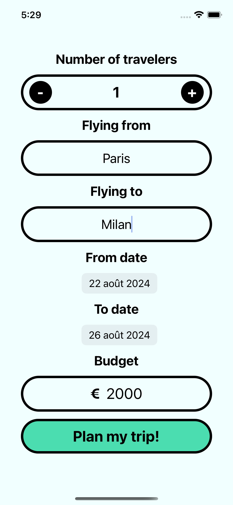
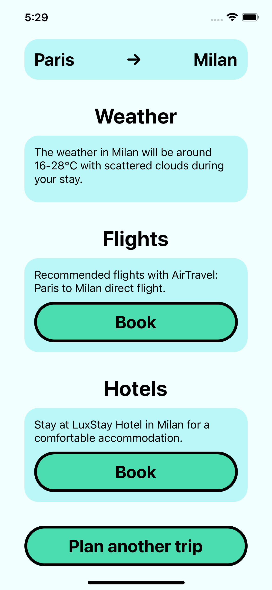

# AI Travel Agent

This project is a small AI travel agent application, developed as part of the Scrimba AI Engineer Path courses. The app helps users plan their trips by providing weather information, flight details, and hotel recommendations based on the user's input.

## Table of Contents

- [Features](#features)
- [Tech Stack](#tech-stack)
- [Installation](#installation)
- [Setup](#setup)
- [API Keys](#api-keys)
- [Usage](#usage)
- [Running the App](#running-the-app)
- [Screenshots](#screenshots)
- [Future Enhancements](#future-enhancements)
- [License](#license)

## Features

- Get weather information for the destination.
- Generate realistic flight and hotel data based on the itinerary and budget.
- User-friendly interface for inputting trip details.

## Tech Stack

- **Frontend:** React Native, Expo
- **Backend:** Expo Router API
- **AI:** OpenAI API
- **State Management:** React Context API

## Installation

1. Clone the repository:

   ```sh
   git clone https://github.com/Kevinnko/ai-travel-agent.git
   cd ai-travel-agent
   ```

2. Install the dependencies using npm:

   ```sh
   npm install
   ```

   Or using yarn:

   ```sh
   yarn install
   ```

## Setup

1. Create a `.env` file in the root directory and add your API keys:

   ```env
   OPENAI_API_KEY=your_openai_api_key
   WEATHER_API_KEY=your_weather_api_key
   WEATHER_API_URL=https://api.openweathermap.org
   ```

2. Start the development server:

   ```sh
   npm start
   ```

   Or using yarn:

   ```sh
   yarn start
   ```

## API Keys

You will need to obtain the following API keys:

- **OpenAI API Key:** Sign up at [OpenAI](https://auth.openai.com/authorize) and get your API key.
- **Weather API Key:** Sign up at [OpenWeather](https://openweathermap.org/api) and get your API key.

## Usage

1. Open the app on your device or simulator.
2. Enter the trip details including the departure and destination locations, dates, budget, and number of passengers.
3. Click on "Plan my trip!" to get the weather, flights, and hotels information.

## Running the App

You can run the app on different platforms using Expo. Here are the steps:

### Running on iOS

1. Make sure you have Xcode installed on your Mac.
2. Start the development server:
   ```sh
   npm start
   ```
   Or using yarn:
   ```sh
   yarn start
   ```
3. Press `i` to open the app in the iOS simulator.

### Running on Android

1. Make sure you have Android Studio installed and set up on your machine.
2. Start the development server:
   ```sh
   npm start
   ```
   Or using yarn:
   ```sh
   yarn start
   ```
3. Press `a` to open the app in the Android emulator.

### Running on Web

1. Start the development server:
   ```sh
   npm start
   ```
   Or using yarn:
   ```sh
   yarn start
   ```
2. Press `w` to open the app in your default web browser.

For more detailed instructions, refer to the [Expo documentation](https://docs.expo.dev/get-started/installation/).

## Screenshots





## Future Enhancements

Here are some features that could be added to enhance the app:

- [ ] Get real flights and hotels data with Skyscanner, Booking, or other APIs.
- [ ] Add a list of activity ideas for the destination.
- [ ] Make the trip page shareable.
- [ ] Add AI-generated images for the trip.

## License

This project is licensed under the MIT License. See the [LICENSE](LICENSE) file for details.
